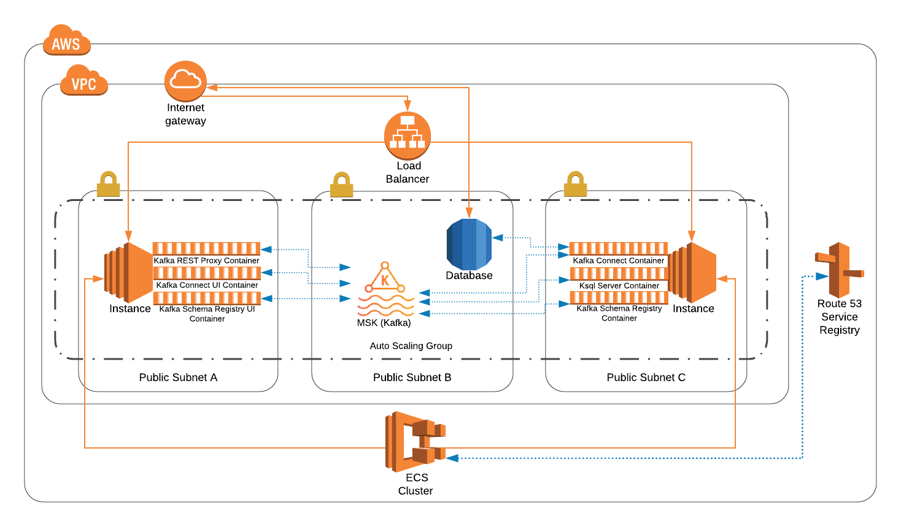
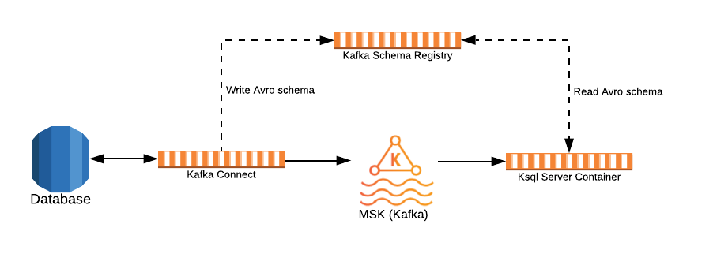

# kafka-aws-deployment
This project deploys Kafka and part of it's ecosystem to AWS through terraform.  
It is mainly developed to help people that want to learn/explore the technology, focused - but not limited - to stream database events.

What is included:

* Kafka Core - AWS MSK
* Kafka Components - AWS ECS
   - Kafka Connect (debezium)
   - Kafka Connect UI
   - Kafka Schema Registry
   - Kafka Schema Registry UI
   - Kafka Rest Proxy API
   - Kafka KSQL Server
* VPC
* RDS Database
* Load Balancer

## Prerequisites

You need the following to deploy the project:

* AWS account https://aws.amazon.com/premiumsupport/knowledge-center/create-and-activate-aws-account/  
      - Create an S3 bucket to store terraform state files https://docs.aws.amazon.com/AmazonS3/latest/gsg/CreatingABucket.html  
      - Create EC2 key pair https://docs.aws.amazon.com/AWSEC2/latest/UserGuide/ec2-key-pairs.html  

* Install Make (optional but recommended). Choose one of the following:  
      - Using chocolatey (package manager): https://chocolatey.org/packages/make  
      - Manual installation: http://gnuwin32.sourceforge.net/packages/make.htm  

* Install Terraform:  
      - Using chocolatey (package manager): https://chocolatey.org/packages/terraform  
      - Manual installation: https://www.terraform.io/downloads.html  

* AWS CLI installed with a profile set on your machine:  
      - Using chocolatey (package manager): https://chocolatey.org/packages/awscli  
      - Manual installation: https://docs.aws.amazon.com/cli/latest/userguide/install-cliv2.html  
      IMPORTANT: After installing it please configure a profile: https://docs.aws.amazon.com/cli/latest/userguide/cli-chap-configure.html#cli-quick-configuration

## Usage

   Before you deploy anything you need to make sure variables are set as expected on `aws-infrastructure\configuration`.  
   There are 5 configuration files where most variables are set with default values *however* there is a section on top of each file called **NEED CONFIGURATION** that needs your manual intervention.

   Position on the root level of this project
   
   **Deploy:**

   <details><summary>Using Make</summary>
   <p>

   * To deploy all of terraform
      ```console
      make deploykad
      ```

   * To deploy VPC
      ```console
      make deployvpc
      ```

   * To deploy MSK
      ```console
      make deploymsk
      ```

   * To deploy ECS
      ```console
      make deployecs
      ```

   * To deploy RDS
      ```console
      make deployrds
      ```
   </p>
   </details>

   <details><summary>Manual Terraform</summary>
   <p>

   * To deploy VPC
      ```console
      cd aws-infrastructure/deployment/kad-vpc
      terraform init -backend-config="../../configuration/terraform-backend.tfvars"
      terraform apply -auto-approve -var-file="../../configuration/global-config.tfvars"
      ```

   * To deploy MSK
      ```console
      cd aws-infrastructure/deployment/kad-msk
      terraform init -backend-config="../../configuration/terraform-backend.tfvars"
      terraform apply -auto-approve -var-file="../../configuration/global-config.tfvars" -var-file="../../configuration/msk-config.tfvars"
      ```

   * To deploy ECS
      ```console
      cd aws-infrastructure/deployment/kad-ecs
      terraform init -backend-config="../../configuration/terraform-backend.tfvars"
      terraform apply -auto-approve -var-file="../../configuration/global-config.tfvars" -var-file="../../configuration/ecs-config.tfvars"
      ```

   * To deploy RDS
      ```console
      cd aws-infrastructure/deployment/kad-rds
      terraform init -backend-config="../../configuration/terraform-backend.tfvars"
      terraform apply -auto-approve -var-file="../../configuration/global-config.tfvars" -var-file="../../configuration/rds-config.tfvars"
      ```
   </p>
   </details>

   **Destroy:**

   <details><summary>Using Make</summary>
   <p>

   * To destroy all of terraform
      ```console
      make destroykad
      ```
      `kad = kafka aws deployment`

   * To destroy RDS
      ```console
      make destroyrds
      ```

   * To destroy ECS
      ```console
      make destroyecs
      ```

   * To destroy MSK
      ```console
      make destroymsk
      ```

   * To destroy VPC
      ```console
      make destroyvpc
      ```

   </p>
   </details>

   <details><summary>Manual Terraform</summary>
   <p>

   * To destroy RDS
      ```console
      cd aws-infrastructure/deployment/kad-rds
      terraform init -backend-config="../../configuration/terraform-backend.tfvars"
      terraform destroy -auto-approve -var-file="../../configuration/global-config.tfvars" -var-file="../../configuration/rds-config.tfvars"
      ```

   * To destroy ECS
      ```console
      cd aws-infrastructure/deployment/kad-ecs
      terraform init -backend-config="../../configuration/terraform-backend.tfvars"
      terraform destroy -auto-approve -var-file="../../configuration/global-config.tfvars" -var-file="../../configuration/ecs-config.tfvars"
      ```

   * To destroy MSK
      ```console
      cd aws-infrastructure/deployment/kad-msk
      terraform init -backend-config="../../configuration/terraform-backend.tfvars"
      terraform destroy -auto-approve -var-file="../../configuration/global-config.tfvars" -var-file="../../configuration/msk-config.tfvars"
      ```

   * To destroy VPC
      ```console
      cd aws-infrastructure/deployment/kad-vpc
      terraform init -backend-config="../../configuration/terraform-backend.tfvars"
      terraform destroy -auto-approve -var-file="../../configuration/global-config.tfvars"
      ```
   </p>
   </details>

   
## AWS Architecture

Important Notes:
   
   The architecture is designed for Kafka exploration and not a proper production deployment.
   
   * The database is placed on a public subnet to allow interaction with RDS through external database clients such as DBeaver, pgAdmin.
   * An autoscaling group is in place to facilitate the addition of new containers without worrying about the underlying infrastructure. You can change min, max and desired number of instances on this file `aws-infrastructure\configuration\ecs-config.tfvars`



## Example of Data Flow



